# GreenMap ♻️ — Sistema Gamificado de Reciclagem

Trabalho Prático 2 — Disciplina de Banco de Dados  
Curso de Engenharia de Software — UFCA  
**Grupo 03**

---

## Modelo Entidade-Relacionamento (MER)



---

## Diagrama Entidade-Relacionamento (DER)



---

## Decisões de Ajuste do Modelo (TP1 → TP2)

| Decisão | Justificativa |
|---|---|
| `cooperativa` usa `GENERATED ALWAYS AS IDENTITY` em vez de `SERIAL` | Explica uso de tipos modernos do PostgreSQL 16 |
| `foto_evidencia` permanece como `BYTEA` | Armazenamento direto no banco; em produção seria uma URL de storage |
| `morador.id_bairro` aceita NULL | `ON DELETE SET NULL` — bairro pode ser removido sem excluir o morador |
| Validação de CPF/CNPJ feita na aplicação | PostgreSQL não tem CHECK nativo para formato; validação via algoritmo Python |
| Verificação de vagas em evento feita na aplicação | Requer `COUNT(*) + comparação`, não expressável como CHECK constraint |
| `senha` armazenada em texto puro no seed | **Apenas para fins didáticos.** Em produção: bcrypt/argon2 |
| Consulta Q4 (denúncias por bairro) faz JOIN com `morador` | Denúncia não tem `id_bairro` diretamente; bairro é inferido pelo morador autor |

---

## Como Executar

### Com Docker (recomendado)

```bash
# Clone o repositório
git clone https://github.com/jetrokepler/greenmap
cd greenmap

# Copie as variáveis de ambiente
cp .env.example .env

# Suba os containers (banco + app)
docker compose up --build

# Acesse: http://localhost:8501

# CLI (alternativa) — em outro terminal
docker compose exec app python main_cli.py
```

### Sem Docker

```bash
pip install -r requirements.txt

# Configure o arquivo .env com as credenciais do seu PostgreSQL
cp .env.example .env
# Edite .env com suas credenciais

# Crie o banco manualmente:
psql -U <usuario> -d <banco> -f database/init.sql
psql -U <usuario> -d <banco> -f database/seed.sql

# Streamlit
streamlit run app/main.py

# CLI (alternativa)
python main_cli.py
```

---

## Credenciais de teste (seed.sql)

| Perfil | E-mail | Senha |
|---|---|---|
| Gestor | `david@collector.com` | `hash_david_123` |
| Gestor | `angelo@collector.com` | `hash_angelo_123` |
| Morador | `jetro@email.com` | `hash_jetro` |
| Morador | `carlos@email.com` | `hash_carlos` |
| Morador | `ana@email.com` | `hash_ana` |

---

## Estrutura do Projeto

```
greenmap/
├── database/
│   ├── init.sql          # DDL completo (14 tabelas, todas as constraints)
│   └── seed.sql          # Dados de teste
├── app/
│   ├── db/
│   │   └── connection.py # Singleton PostgreSQL (psycopg3)
│   ├── models/           # Dataclasses (sem SQL)
│   │   ├── usuario.py, morador.py, gestor.py, bairro.py
│   │   ├── ponto_de_coleta.py, tipo_de_residuo.py
│   │   ├── cooperativa.py, conquista.py, denuncia.py
│   │   ├── evento.py, registro_descarte.py
│   │   └── associativas/
│   │       ├── morador_conquista.py, morador_evento.py
│   │       └── ponto_tipo_residuo.py
│   ├── repositories/     # SQL puro — padrão Repository/DAO
│   │   ├── base_repository.py
│   │   ├── usuario_repository.py, morador_repository.py
│   │   ├── gestor_repository.py, bairro_repository.py
│   │   ├── tipo_residuo_repository.py, cooperativa_repository.py
│   │   ├── conquista_repository.py, denuncia_repository.py
│   │   ├── evento_repository.py, ponto_repository.py
│   │   └── registro_repository.py
│   ├── services/
│   │   ├── gamificacao_service.py   # Pontos + conquistas
│   │   ├── validacao_service.py     # CPF, vagas, e-mail único
│   │   └── relatorio_service.py     # Relatórios ambientais
│   ├── views/
│   │   ├── page_login.py
│   │   ├── morador/                 # Dashboard do Morador
│   │   └── gestor/                  # Dashboard do Gestor
│   └── main.py                      # Streamlit (interface web)
├── main_cli.py                       # Interface CLI com menus navegáveis
├── docker-compose.yml
├── Dockerfile
└── requirements.txt
```

---

## Consultas SQL Implementadas (≥ 6, ≥ 3 parametrizáveis)

| # | Consulta | Método | Parâmetros | Tabelas |
|---|---|---|---|---|
| Q1 | Ranking por bairro | `MoradorRepository.get_ranking` | `id_bairro` | `morador`, `usuario` |
| Q1b | Ranking por bairro + período | `MoradorRepository.get_ranking_periodo` | `id_bairro`, `data_ini`, `data_fim` | `morador`, `usuario`, `registro_descarte` |
| Q2 | Ecopontos por bairro e tipo | `PontoRepository.find_by_bairro_tipo` | `id_bairro`, `id_tipo` | `ponto_de_coleta`, N:N tabela |
| Q3 | Histórico de descartes | `RegistroRepository.find_by_morador` | `id_usuario` | `registro_descarte`, `tipo_de_residuo`, `ponto_de_coleta` |
| Q4 | Denúncias por bairro e status | `DenunciaRepository.find_by_bairro_status` | `id_bairro`, `status` | `denuncia`, `usuario`, `morador` |
| Q5 | Eventos com vagas | `EventoRepository.find_com_vagas` | — | `evento`, `morador_evento` |
| Q6 | Total kg por tipo | `RegistroRepository.total_por_tipo` | — | `registro_descarte`, `tipo_de_residuo` |
| Q7 | Conquistas de um morador | `ConquistaRepository.find_by_morador` | `id_usuario` | `morador_conquista`, `conquista` |
| Q8 | Ranking de cooperativas | `CooperativaRepository.ranking_validacoes` | — | `cooperativa`, `registro_descarte` |

---

## Operações CRUD

### INSERT (≥ 3 tabelas, incluindo N:N)
- `usuario` + `morador` — cadastro de morador (via tela de cadastro)
- `registro_descarte` — registrar descarte
- `morador_evento` (**N:N**) — inscrição em evento
- `morador_conquista` (**N:N**) — desbloqueio automático de badge
- `denuncia` — reportar descarte irregular

### UPDATE (≥ 1 tabela)
- `morador.pontuacao_acumulada` — creditar pontos após aprovação
- `registro_descarte.status_validacao` — aprovar/rejeitar descarte
- `ponto_de_coleta.status` — colocar ecoponto em manutenção
- `denuncia.status` — atualizar status de denúncia

---

## Tecnologias

- **SGBD:** PostgreSQL 16
- **Driver:** psycopg3 (`psycopg[binary]`)
- **Interface Web:** Streamlit ≥ 1.32
- **Interface CLI:** Python puro (menus navegáveis)
- **Containerização:** Docker + Docker Compose
- **ORM:** ❌ Nenhum — SQL puro em todos os repositórios
